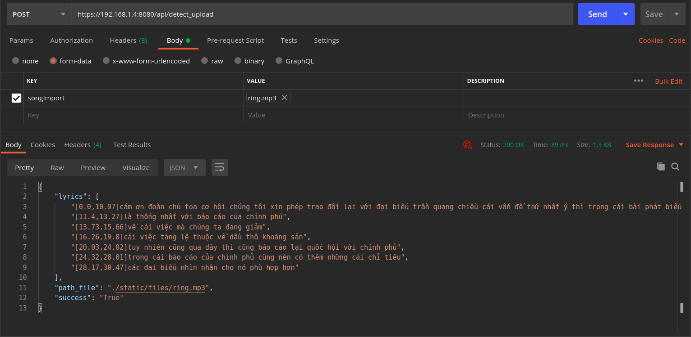

## API

### 1. API tạo project: `/api/detect_upload` method POST 

**Request**

Body (from-data)

* songImport (string): Tên file mp3, mp4
  

**Response**

Body

* lyrics (string): Lòi của đoạn văn được nhận dạng
* path_file (string): Đường dẫn tới file 
* success (string): 

